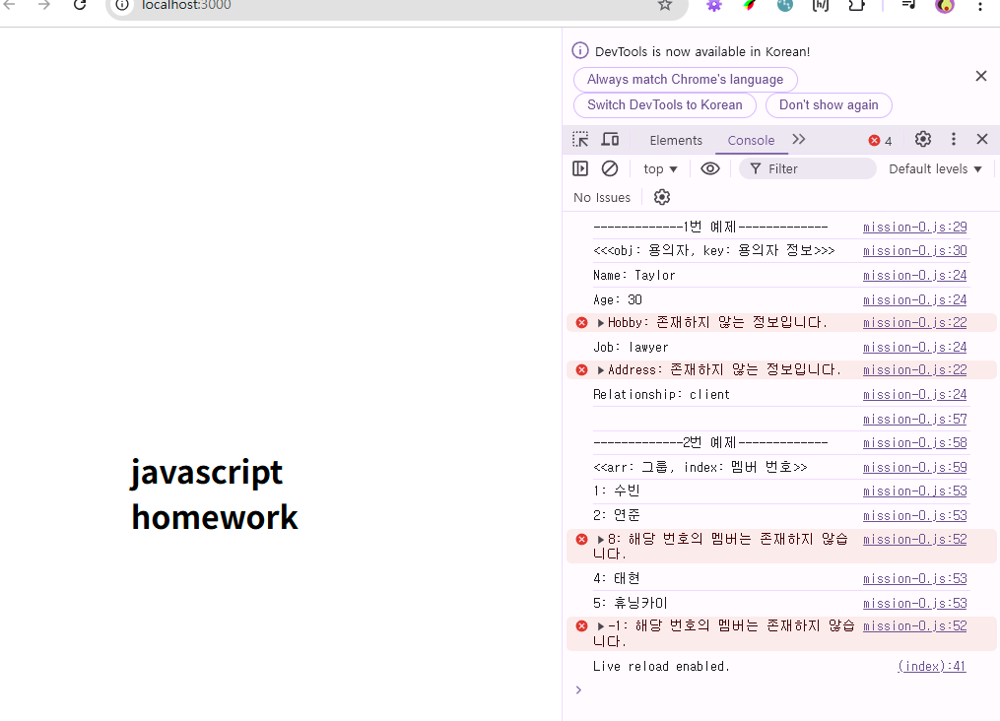

## 자바스크립트 과제

1. mission00

   - 내용 : 객체에서 특정 키의 값을 안전하게 가져오는 함수 / 배열에서 특정 인덱스의 값을 안전하게 가져오는 함수
   - 과제 파일 링크 : [mission01](./mission01/mission-0.js)
     
    

    
결과 캡쳐 이미지

    

      
    

    

2. mission02

   - 내용 : 엘리멘탈 포스터 갤러리 페이지. 썸네일 이미지를 클릭하면 메인 이미지와 배경이 바뀔 수 있도록 코드 로직을 작성해주세요.
   - 과제 파일 링크 : [mission01](./mission02/client/main.js)