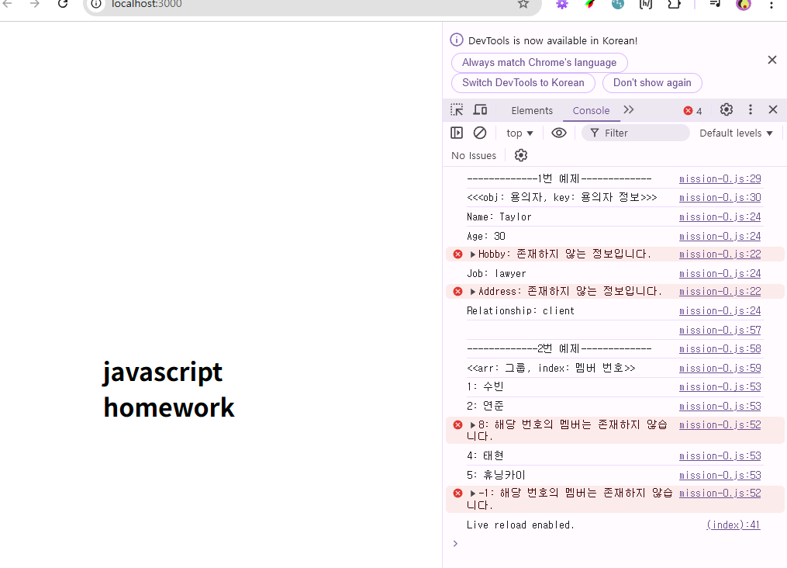

## 자바스크립트 과제

1. mission01

   - 내용 : 객체에서 특정 키의 값을 안전하게 가져오는 함수 / 배열에서 특정 인덱스의 값을 안전하게 가져오는 함수
   - 과제 파일 링크 : [mission01](./mission01/mission-0.js)
     
    

    
결과 캡쳐 이미지

    

    
    

    

